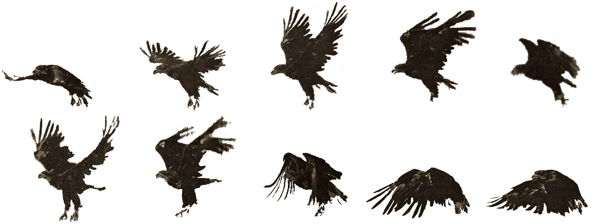

Muybridge Animations: Eagle
===========================

Purpose
-------
bringing to life some old creatures!

Sprite dimensions.
------------------
Now using the improved sprite sheet, where the eye remains
in more or less the same place within the frame.

The top row is flight, the second row is takeoff.

W: 526 * 6

H: 493 * 6

As the original image series was not of a bird in full flight,
but rather a bird taking off and beginning to fly, the flight
is not smooth. Also, the bird was tethered, further lowering
the authenticity of the flight sequence.
